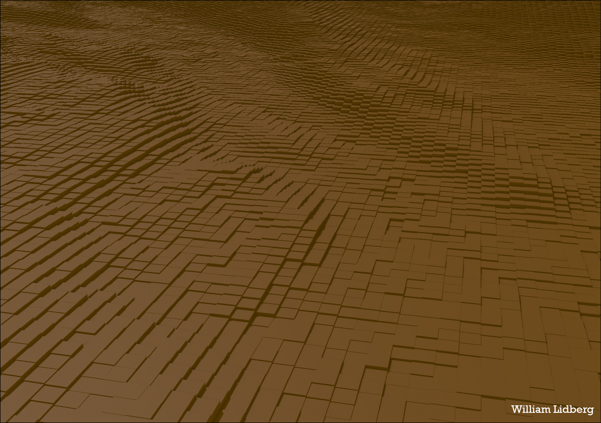

# Digital_Soil_Mapping
Can soil types be extracted from LiDAR point clouds?

Digital soil mapping
Predict quaternary deposits using machine learning

William Lidberg

## 1. INTRODUCTION

Digital soil mapping has moved from research to implementation and machine learning has become an important part of digital soil mapping. Machine learning or statistical learning is when data is used to train a model instead of programming it manually. Machine learning is often referred to as a Black box. A Black Box is a system that does not reveal its internal mechanisms. In machine learning, a “black box” describes models that cannot be understood by looking at their parameters. The opposite of a black box is sometimes referred to as White Box. In fact, Whitebox is the name of the geoprocessing software used for most features in this project and it got its name from the open-access philosophy used in its development. Machine learning and statistics have somewhat different terminology so here is a shortlist of names used: 
Model is a trained machine learning algorithm 
Features are the columns in the training data. In our case, it will be “Elevation”, “topography” etc.
Target is what the model is trying to predict. In our case, it will be soil classes.

## 2. METHOD

The method consists of two major steps: 1 feature extraction and 2 machine learning and prediction. The Feature extraction is mostly done using GIS and python while the machine learning and prediction is done using R.

### 2.1 FEATURE EXTRACTION

Most of the geoprocessing will be done with python scripts that in turn imports tools from ArcGis Pro, Whitebox Tools, and Whitebox GAT. There are some things to keep in mind when using python for these tools. ArcGIS tools require ArcPy to run. ArcPy is a Python site package that's installed with ArcGIS pro. To run a script with Arcpy you right-click the .py file and choose “Run with Arcgis Pro”. 

Whitebox GAT is based on a programming language Jython which runs on the Java platform. Python Scripts intended for Whitebox GAT needs to be run inside the Whitebox GAT scripter. Whitebox Tools is a stand-alone command-line program and Python scripting API. It’s written in the programming language Rust which is often many times faster than tools inside Whitebox GAT. Whitebox Tools requires python 3 (or higher) and can be run with the python installed by ArcGIS pro. All python scripts are saved and run in the local sandbox directory provided by SGU “C:\data\lokala_exe\Python\WhiteboxTools”. R scripts are saved in “C:\data\lokala_exe\R”. Each script has a number indicating the order in which to run them. It’s important that scripts 1 to 12 are run in the right order but scripts above 12 can be run in any order after that.

#### Pre-processing of digital elevation model

In order to facilitate parallel processing for the Environmental features, Sweden had to be split into smaller areas. These smaller areas were in the form of isobasins. First, the 2 m DEM was resampled to a 50 m DEM with the script named “1_ResampleDEM.py”. This script needs to be run with arcpy. The resampled DEM is then imported to whitebox GAT and used to create isobasins with the script “2_CreateIsobasins.py”. This script must be run inside Whitebox GATs scripter (figure 1). 

Figure 1: The whitebox GAT scripter is inside Whitebox GAT. This is where the script “2_CreateIsobasins.py” needs to be run.
The script creates three isobasin layers of different sizes. The larger ones do not reach the coast so the smaller basins were used along the coastline (Figure 2).

Figure 2: Isobasins in three different sizes. These isobasins are used to enable parallel processing while keeping hydrology somewhat intact within each sub-basin.
The point of using isobasins is to facilitate parallel processing. Therefore all input data needs to be split into the isobasin polygons. The ArcPy script “3_SplitDataWithIsobasins.py” will do just that. The isobasin file is merged and each isobasin is split into a separate shapefile. The splitted polygons were then buffered by 1 000 m and used to clip the 2 m DEM and the following features from the Swedish property map: Roads, railroads, and streams.  
The next step is to burn streams across roads using Whitebox GAT. First, the GeoTIFF files (.tif) have to be converted to the Whitebox raster file format (.dep). This is done by first running the script  “4_Create_textfileToImportToWhiteboxGAT_ArcPy.py” This script is run outside of Whitebox GAT and creates a text file with a list of all files to import. The next script “5_ImportGeotiffsToWhiteboxGAT_InsideWhitebox.py” must be run inside Whitebox GATs scripter (figure 2). It uses parallel processing to convert all GeoTIFF files to .dep files. The script “6_Create_textfileToBurnStreamsAtRoadsWhiteboxGAT.py” is used to create a new text file with the arguments for the tool “burn streams at roads”. Once the text file with arguments is complete we can use it to run the next python script “7_BurnStreamsAtRoads.py” This script will find locations where streams from the property map intersect with a road from the property map and then adjust the elevations in the DEM to allow water to pass the roads at the intersections. This will result in a narrow channel across roads (figure 3).

Figure 3: A narrow channel has been breached across the road in the center of the image. This narrow channel will allow water to pass across the road.
Hydrological features
While it’s possible to extract all environmental covariates using one massive python script it would be unintuitive to handle. 
Once streams have been burned across roads it’s time to extract hydrological features such as streams. Streams will be used as a source layer for Elevation above Stream. Streams are extracted from the DEM files that had streams burned across roads by script “7_BurnStreamsAtRoads.py” above and relocated in the folder: “D:\WilliamLidberg\FeatureExtraction\BurnStreamsAtRoads”. Some of the clipped DEM files contained missing data, for example in very big lakes. To avoid potential issues with flow routing the script “8_FillMissingData.py” was used to interpolate internal holes. Once the DEM was corrected it was possible to use Whitebox Tools to extract streams using the script “9_ExtractStreams.py”. The accumulated area required to form a stream varies greatly with season and soil type so two thresholds were used to extract two stream networks. These stream networks have flow accumulation thresholds at 1 ha and 10 ha. 1 ha reflects extreme flows such as spring flood while the 10 ha network represents more average conditions. These stream layers were then used to calculate elevation above stream using the script “10_ElevationAboveStream.py”  
Downslope index is another hydrological feature. It is a measure of the slope gradient between a grid cell and some downslope location (along the flow path passing through the upslope grid cell) that represents a specified vertical drop (i.e. a potential head drop). The python script to extract the downslope index is “11_DownSlopeIndex.py”. It requires a hydrologically correct DEM. The hydrologically corrected DEMs are located in “D:\WilliamLidberg\FeatureExtraction\CompleteBreached”. 

#### Topographical features

The scripts used to extract hydrological features had to be run in a specific order but topographical features can be extracted in any order since all scripts use the same DEM. Topography can be captured in many ways and Whitebox tools have implemented a number of topographical indices. Topography can be modeled on many different scales and it’s hard to know which scale is most important for soil formation. Therefore we will use a number of topographical indices and multiscale topographic position analysis. The python script “12_MaxElevationDeviation.py” uses an integral image-based approach to measuring the common relative topographic position metric deviation from mean elevation. This method captures topographical features on multiple scales using different-sized moving windows (figure 4).

Figure 4: John Lindsays example of a multi-scale topographic position color composite (MTPCC) image created by combining DEVmax rasters from the three scale ranges into the red-green-blue channels of a 24-bit color image. 
The script “14_MultiScaleRoughness.py” works in a similar fashion to “12_MaxElevationDeviation.py” but calculates surface roughness over a range of spatial scales. In this case with a search radius from 1 grid.  cell to 10 grid cells using a step size of 2. The script “18_CircularVarianceOfAspect.py” calculates circular variance of aspect with a 3 cell filter, “15_StandardDeviationFromSlope.py” calculate standard deviation from slope with a 3 cell filter, and “19_DeviationfromMeanElevation.py” calculates deviation from mean elevation with a 7 cell filter. 

 #### Other spatial data
 
Other spatial data used was X and Y coordinates. R scripts used to create these rasters are “X_Raster.R” and “Y_Raster.R. Using current soil maps is a way to take existing expert information into account and extrapolate that information. Rules and patterns can be learned from these soil maps and then applied to the rest of the landscape. Nationella Marktäckedata (NMD) was also used and had to be resampled from a 10 m resolution to a 2 m resolution using the script “102_ResampleNMD.py” in ArcGIS pro. A shapefile with SGUs quaternary deposits was converted to raster with the script “100_ConvetSoilToraster.py”. SGU also provided a raster with Elevation below HK that was converted to 2 m resolution and clipped to lidar squares using “106_ClipHKDepth.py”.

**List of features**

All features are stored in “D:\WilliamLidberg\FeatureExtraction\Completed_Features” The features are:
  * DEM = Digital elevation model
  * EAS 1ha = Elevation above stream from a 1 ha stream network
  * EAS 10ha = Elevation above stream from a 1 ha stream network
  * DI2m = Downslope index with 2 m drop
  * CVA = Circular variance of aspect
  * SDFS = Standard deviation of Slope
  * DFME = Deviation from mean elevation
  * Rugged = Terrain ruggedness index
  * NMD = Nationella Marktäckedata
  * SoilMap = Quaternary deposits
  * HKDepth = Elevation under HK
  * SoilDepth = Depth to bedrock 
  * LandAge = Age from deglaciation 
  * MSRM = Multi Scale roughness magnitude  
  * CoordinateX = X coordinates of all cells in Swereff99 ™
  * CoordinateY = Y coordinates of all cells in Swereff 99 ™
  * MED = Maximum Elevation deviation

#### Prepare GIS data for prediction

Once all GIS data was calculated for each isobasin it was mosaiced together into one large file covering all of Sweden. The machine learning prediction is done on multiband rasters where each GIS layer is a band. In order to facilitate the prediction on SGUs computer, the input data had to be split into tiles with the same number of rows and columns and spatial extent. First, the script “100_ClipToLiDARSqares.py“ was used to clip the DEM into the same 2.5 km squares that lantmäteriet uses for LiDAR data (Figure 5). 

Figure 5: Example of a clipped square. This will be the base for clipping all data.
The clipped DEM was then used as a reference and all remaining raster data was clipped into the same extent, nr of rows, columns and resolution. This was done using scripts such as “101_ClipEAS1ha.py”. These scripts can be modified to clip any rasters by changing the input clip raster. As long as the same extent, number of rows, columns, and resolution is used for all rasters it is possible to add more data in the future. All clipped raster data is stored in: “D:\WilliamLidberg\FeatureExtraction\Completed_Features”. The clipped rasters were then combined into multiband rasters using the two scripts in the folder “C:\data\lokala_exe\Python\WhiteboxTools\Compositebands”. The first script “Master_multithread_compositebands.py”  runs the script “Slave_compositebands.py” for each lidar square. The result is one multiband raster for each of the lidars squares. 

#### Add new features in the future

The aim of this project was to set up a framework for SGU to work with machine learning and digital soil mapping. The 17 features included here should be seen as a starting point, not a complete list. New features should be added to improve the accuracy of the prediction. The process of adding new features is done by following steps.
Resample data to 2 m and 32-bit float with Nodata value -3,4028231e+38. The ArcGIS Pro tool “copy raster” can be used to change Pixel type and NoData values. The ArcgisPro tool “resample '' can also be used to change resolution if necessary.
Clip the resampled raster to the lidar squares by using the python script “100_ClipRasterToSameExtent.py”
Create composite bands by adding the new band/bands to the Python script “Master_multithread_ADDBands.py”. And “Slave_ADDBands.py” in the folder: “C:\data\lokala_exe\Python\WhiteboxTools\AddNewDataToExistingComposites”
Add the new band to the R script and name it the same as the corresponding column in the training data. If the new data is categorical it should be treated as factors in R.

Extracting data from the new raster is best done in ArcGIS pro using the tool “Extract multiple values to points” (Figure 6).
 
Figure 6: Example of how to extract new feature data to the training data points.
Use the trainingdata.shp shapefile in the folder “C:\data\lokala_exe\TrainingData” as input point data and add the rasters as input rasters. All completed features are located in “D:\WilliamLidberg\FeatureExtraction” and or in “D:\WilliamLidberg\FeatureExtraction\Completed_Features” use the R script “Gdal_Viritual_raster.R” to build a .vrt file. A .vrt file is a virtual raster that can be used to extract data to the points. Choose a short output field name without spaces and unconventional characters. Do not choose to interpolate values at points. Once the processing is done you can export the table from ArcGIS and import it into R for training.  

### 2.2 Machine learning and prediction
The machine learning methods evaluated in this project were all based on supervised learning. Meaning we need to train a model by showing a large number of examples of what we want to predict. For this purpose, SGU provided a dataset with ~300 000 points of classified quaternary deposits (figure 7).

Figure 7: Training data from SGU. Note that most data is in southern Sweden.
Quaternary deposits were grouped by 7 processes by SGU (Table 1). The data is not evenly distributed and process code 3 (Morän) is many times larger than other soil types (figure 8)
Table 1: List of processes and codes. The predicted raster will have values based on the code field.  
Process 
Code
Berg
1
Morän
3
Glaciala finsediment
5
Glacifluviala sediment
6
Torv
7
Postglaciala finsediment
8
Postglaciala grovsediment
9

Figure 8: Distribution of the process class. 
Values from all features were extracted to these points using the tool “Extract multiple values to points” in arcgis Pro (Figure 6). Before the training data could be used for machine learning it was inspected for multicollinearity (figure 9). HKdepth is negatively correlated to elevation (red color) and EAS1ha has a strong positive correlation with EAS10ha (blue color). Standard deviation from slope and ruggedness index are also positively correlated. If storage space is a problem these are the variables that could possibly be removed without a large impact on the model accuracy.  

Figure 9: Correlation plot of features. Blue means positive correlation and red negative correlation. Highly correlated variables are not a big problem but if two variables are highly correlated it might be possible to remove one of them without losing the accuracy of the model.

## Evaluating different machine learning methods

There are many different kinds of machine learning algorithms and it’s difficult to know in advance which one is the best for the job. Therefore a number of methods were tested to find the best one for this problem and dataset. These evaluations are documented in the R script “Evaluation of methods.Rmd”. The methods tested were Random forest, support vector machine, Neural network, stochastic gradient boosting and Extreme gradient boosting. A subset of 50 % of the original dataset was used for evaluating different methods. This subset was done to speed up the processing time and this 50 % subset was further split into 70 % training data and 30 % test data. Each method was tuned using carets grid tuning function to find the optimal hyperparameters. This means that multiple combinations of hyperparameters are tested to find the most optimal model (figure 10).  All models were tuned using 5-fold cross-validation. 

Figure 10: Example of result from hyperparameter tuning of a neural network. Multiple models are built with different hyperparameters. In the case of neural networks, more hidden units resulted in a more accurate model but the curve flattens out after 5 hidden units.
Once all models were tuned they were evaluated against test data. Random forest, stochastic gradient boosting, and Extreme gradient boosting performed well but extreme gradient boosting was the most accurate method with kappa value = 0.73 (Table 2). The machine learning model used for predicting soil types was Extreme Gradient Boosting  (XGBoost dart). 

Table 2: Overall accuracy can be misleading since the training data is unbalanced and most of Sweden is covered by till soil. The kappa value is a more balanced metric of accuracy. Extreme gradient boosting was the most accurate model and will therefore be used to predict quaternary deposits. 
Algorithm
Kappa value
Overall Accuracy
Random Forest
0.71
78 %
Support vector machine
0.53
66 %
Neural network
0.48
63 %
Stochastic gradient boosting
0.72
79 %
Extreme gradient boosting
0.73
80 %

Decision tree-based algorithms such as random forest have been shown to perform well in the field of digital soil mapping and XGBoost is a more advanced implementation of decision trees. XGBoost is a supervised learning method where training data is used to train a model with multiple features to predict a target variable. In our chase, the training data consists of points extracted from soil polygons manually mapped by experts (~300 000 points). The features are GIS layers extracted above and the target variable is the classification of soils. 

## Training the final model

The R package Caret and the R script “ExgboostTuneAndPredict.Rmd” were used to train and tune the XGBoost learning. The first step is to load a text file “C:\data\lokala_exe\TrainingData\trainingdata.txt” containing the training data and remove missing data and convert numbers to numbers and strings to factor.
Next, the complete dataset was split into training data (70 % of the data) and test data (30 % of the data). As the name implies the training data will be used to train the model and then the model will be tested on the test data. XGBoost has several settings that affect the training of the model and these settings are called hyperparameters. It’s difficult to assess the correct settings of the hyperparameters in advance so multiple settings and combinations of settings were tested. This testing was done using a grid tuning approach implemented in caret. The model is trained multiple times on parts of the training data and tested on the remaining data. This is called cross-validation and the result of the tuning is plotted in figure 11.

Figure 11: Result from hyperparameter tuning of XGBoost. The most accurate model had 500 trees and a depth of 10 features (10 features were randomly selected for each tree). 
Once the hyperparameters are tuned it’s time to test the model on the 30 % test data that was set aside above. The final model had a kappa value of 0.75 and overall accuracy of 81 %. Overall accuracy is the percent of points in the training data that the model managed to predict. However, some soil classes have a higher accuracy than others (table 3).

Table 3: The model was better at predicting rock, till and peat but struggled a bit more with distinguishing between sediments.
Process 
Accuracy
Berg
99 %
Morän
91 %
Glaciala finsediment
83 %
Glacifluviala sediment
76 %
Torv
89 %
Postglaciala finsediment
82 %
Postglaciala grovsediment
71 %

Not all variables are included in each decision tree built during training. This results in different accuracy for each tree where trees without important variables have less predictive power. This accuracy importance is saved and can be plotted as a variable importance plot (figure 12).

Figure 12: These are the top 20 most important features. Note that each class of NMD is it’s own feature.
Not all features are useful for the prediction and some of these can be removed. Also if some features are highly correlated it is possible to remove some of them without losing accuracy. XGBoost can handle highly correlated variables but considering that each variable is over 1 TB of data to store it makes sense to remove the unnecessary ones. 
                                
Use the final model to predict demo areas
Once the model is trained it can be put into production and predict soils on the multiband rasters created using the composite band script above. This is done in parallel so that each thread on the processor predicts a multiband tile. The R script “ExboostTuneAndPredict.Rmd” was used to both train the model and apply the model to all multiband rasters. SGU selected a number of areas spread across Sweden that will be used to test and evaluate the method  (Figure 14).

Figure 13: Demo areas are marked in yellow.
The machine learning model predicts a high-resolution 2m map of quaternary deposits (figure 14). 

Figure 14: Example from the demo area. The current soil map is displayed on the left and the high-resolution soil map predicted with machine learning is on the right. Kappa value is 0.75 with an overall accuracy of 81 %.  Aprx is located in “D:\WilliamLidberg\testområden\DemoAreas”.
Predict on smaller or different areas
The “Master_multithread_compositebands.py” and “Slave_compositebands.py” scripts created composite rasters that are used for the prediction of quaternary deposits. However, if a smaller area is desired it is unnecessary to predict on all composite rasters in the folder (D:\WilliamLidberg\FeatureExtraction\CompositeBands). We need to copy the raster composites over the desired area into a new folder and change the path to the prediction folder in the R script. One way to do this is to use the lidar squares shapefile (D:\WilliamLidberg\LiDAR_Rutor\LaserSquaresIndex.shp) from lantmäteriet to select squares of interest. Select and export squares of interest into the folder “D:\WilliamLidberg\LiDAR_Rutor_Subset” and run the script “1000_CopyRasterComposites WithLidarsquares.py” This script will split the lidar squares by the column “splitid” and then copy the composite rasters with the same id to: D:\WilliamLidberg\CustomPrediction\CompositeRasters. The script “CopyRasterComposites WithLidarsquares.py” is currently set up to both split and copy lidar squares that intersect with the demo areas. 
Remember to change the path to the folder containing the copied raster composites in the R script (Figure 15).

Figure 15: the path needs to be set to the folder where the raster composites are located. 

This documentation was written by William Lidberg at SLU 2020. 
Mail: william.lidberg@slu.se

